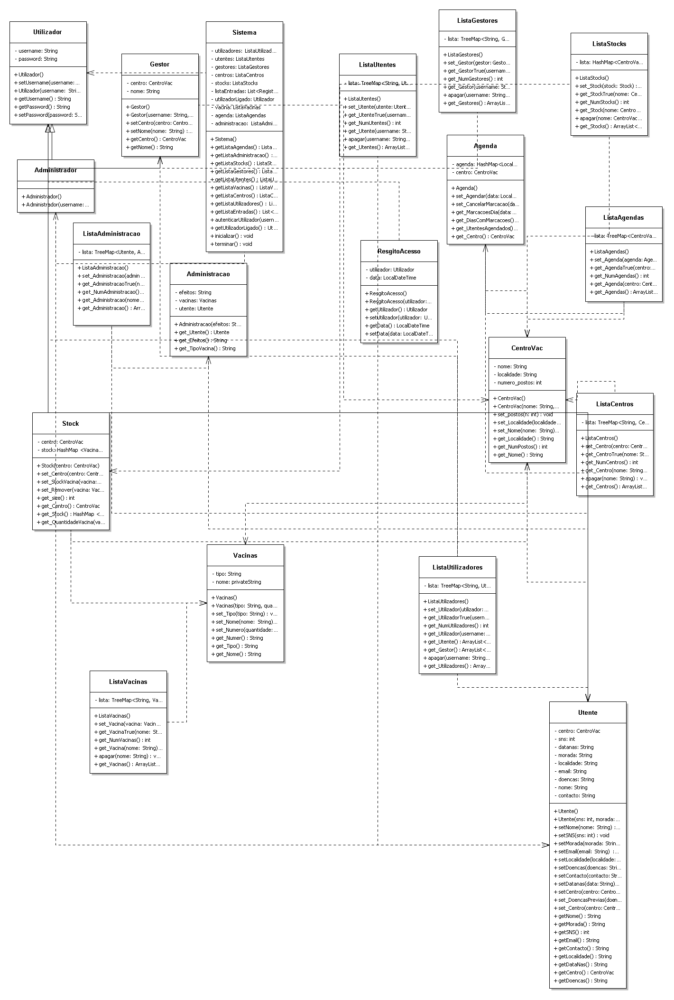

# Introdução 
No âmbito da unidade curricular de Paradigmas de Programação, foi proposto a criação de uma aplicação informática que permitisse gerir o processo de vacinação covid-19.  

Para a concretização deste trabalho apliquei o que aprendi durante o semestre e utilizei, também, os recursos fornecidos pelos docentes e ainda documentação API e Google.

Este projeto é constituído por duas partes: Backend e Frontend que se encontram numa outra pasta deste mesmo ficheiro.

# Funcionalidades 

|Funcionalidades |Implementada |Não Implementada |
| :-: | - | :-: |
|Administrador: | | |
|Autenticar-se como administrador. |X | |
|Criar/apagar e editar centros de vacinação. |X | |
|Adicionar/apagar/alterar/listar utilizadores Gestores. |X | |
|Associar gestores a centros de vacinação. |X | |
|Listar informação sobre centros de vacinação. |X | |
|Alocar quantidades de vacinas a centros de vacinação. |X  | |
|Número de vacinas administradas e efeitos secundários registados na população vacina. | |X  |
|Gestor: | | |
|Autenticar-se como gestor. |X | |
|Listar informação sobre o seu centro de vacinação. |X | |
|Criar ou alterar o número de postos de atendimento. |X | |
|Consultar marcações do centro de vacinação por dia do calendário. | |X |
|Cancelar marcações. | |X |
|Limitar o número de marcações por dia. | |X |
|Monitorizar stock de vacinas do seu centro. |X | |
|Consultar listagens de utentes associados ao centro de vacinação. |X | |
|Consultar listagens de utentes com marcações para o dia seguinte. | |X |
|Registar vacinação de utente, tipo de vacina atribuída e efeitos secundários observados no locar, se necessário. | |X |
|Fazer marcação da próxima administração de dose, se for o caso. | |X |
|Consultar listagem de utente que faltaram à marcação. | |X |
|Obter estatísticas sobre o progresso da vacinação e efeitos secundários registados no seu centro. | |X |
|Utente: | | |
|Criar conta com o seu número SNS, morada, localidade, data de nascimento, contacto telefónico e email. |X | |
|Autenticar-se como utente. |X | |
|Registar informação sobre doenças prévias. |X | |
|Consultar o centro de vacinação atribuído. |X | |
|Escolher centro de vacinação, caso não tenha nenhum atribuído. |X | |
|Fazer marcação para a 1º vacinação, por dia e slot de 15 minutos. | |X |
|Consultar a data da sua próxima marcação. | |X |

# Diagrama de Classes 
De seguida apresenta-se o diagrama de classes do nosso projeto. 

# Documentação Javadoc 
A documentação gerada (javadoc) relativa às classes que foram criadas poderão ser encontradas na seguinte diretoria: “dist\javadoc\index.html”. 

# Conclusão  
Com a elaboração deste projeto de gestão do processo de vacinação foi me possibilitada a aplicação dos conhecimentos que adquirimos no decorrer do semestre e melhorar as minhas habilidades em programação JAVA. 
